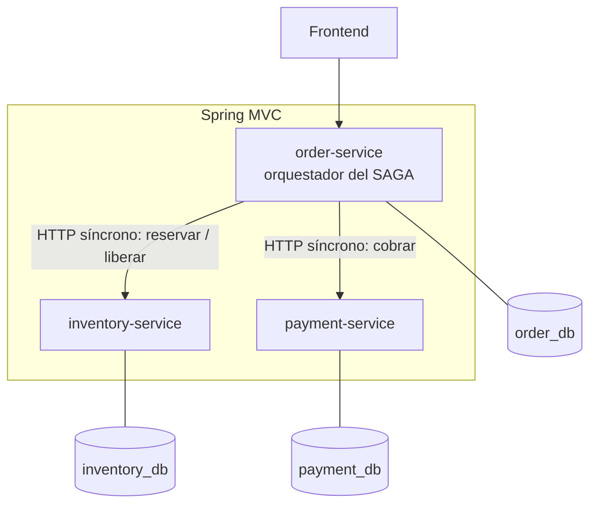

# Order Management System — Versión síncrona (referencia histórica)

> Esta rama documenta el estado del proyecto **antes** de introducir Kafka.
> Se conserva como referencia para comparar el enfoque de orquestación
> síncrona (HTTP directo entre servicios) contra la versión asíncrona
> basada en eventos, disponible en `main`.

## Arquitectura



`order-service` orquesta el flujo del pedido llamando directamente por HTTP
(`RestClient`) a `inventory-service` y `payment-service`, en una única
transacción de request bloqueante: reservar stock → cobrar → confirmar, con
compensación explícita (liberar stock) si el cobro falla.

## Stack

| Categoría | Tecnología |
|---|---|
| Lenguaje / runtime | Java 21 |
| Framework | Spring Boot 3.3 (Spring MVC) |
| Persistencia | Spring Data JPA + PostgreSQL (database-per-service) |
| Comunicación entre servicios | HTTP síncrono (`RestClient`) |
| Infraestructura local | Docker Compose (solo PostgreSQL) |

## Patrones implementados en esta versión

- **Database per service** — cada servicio con su propio esquema PostgreSQL, sin acceso cruzado.
- **SAGA por orquestación (síncrona)** — `order-service` coordina reservar → cobrar → confirmar, ejecutando la compensación (liberar stock) si el cobro es rechazado.
- **Manejo centralizado de errores** — `GlobalExceptionHandler` por servicio, traduciendo excepciones de dominio a códigos HTTP (409 stock insuficiente, 402 pago rechazado).

## Limitación conocida de este enfoque

El endpoint `POST /api/orders` mantiene la conexión HTTP abierta durante
todo el SAGA — el cliente espera el resultado final (`CONFIRMED` o
`CANCELLED`) en la misma respuesta. Si algún servicio remoto está lento o
caído, la latencia y el riesgo de fallo en cascada crecen con cada paso
síncrono adicional. Esta limitación es la motivación directa del rediseño
a mensajería asíncrona con Kafka, disponible en `main`.

## Endpoints principales

**order-service** (`:8081`)
- `POST /api/orders` — crea el pedido y ejecuta el SAGA completo antes de responder.
- `GET /api/orders/{id}`
- `GET /api/orders`

**inventory-service** (`:8082`)
- `POST /api/products`, `GET /api/products`, `GET /api/products/{id}`
- `POST /api/inventory/reserve`
- `POST /api/inventory/release/{orderId}`

**payment-service** (`:8083`)
- `POST /api/payments` — simula rechazo si el monto supera 1000.
- `POST /api/payments/{orderId}/refund`
- `GET /api/payments/{id}`, `GET /api/payments?orderId=...`

## Cómo correr esta versión localmente

**Requisitos:** Java 21, Maven, Docker Desktop.

```bash
docker-compose -f docker-compose.dev.yml up -d   # solo levanta las 3 bases PostgreSQL
```

Luego corre cada servicio desde IntelliJ o con `mvn spring-boot:run`:

| Servicio | Puerto |
|---|---|
| `order-service` | 8081 |
| `inventory-service` | 8082 |
| `payment-service` | 8083 |

```bash
curl -X POST http://localhost:8082/api/products \
  -H "Content-Type: application/json" \
  -d '{"sku":"SKU-1","name":"Teclado mecanico","initialStock":50}'

curl -X POST http://localhost:8081/api/orders \
  -H "Content-Type: application/json" \
  -d '{"customerId":"cust-1","items":[{"productSku":"SKU-1","quantity":2,"unitPrice":19.90}]}'
```

La respuesta ya trae el `status` final (`CONFIRMED` o `CANCELLED`) — a
diferencia de la versión en `main`, aquí no hace falta volver a consultar.