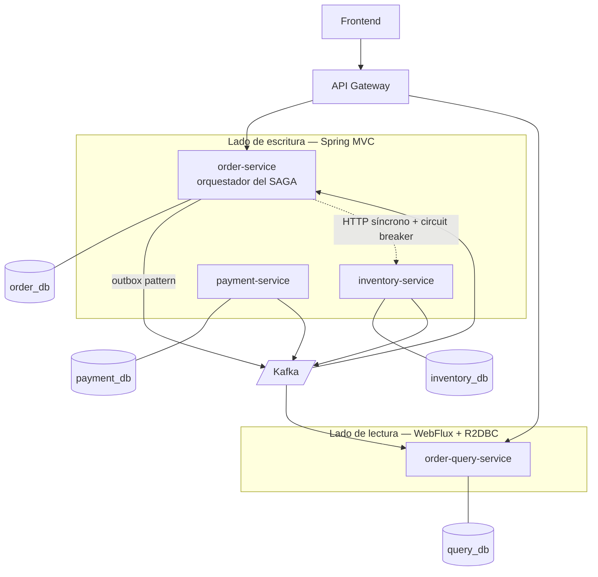

# Order Management System

Sistema de gestión de pedidos basado en microservicios, diseñado como pieza
de portafolio para demostrar patrones de arquitectura distribuida de uso
común en sistemas Java/Spring de nivel productivo: SAGA, mensajería
asíncrona con entrega confiable vía Outbox, CQRS, tolerancia a fallos y
programación reactiva.

## Arquitectura



`order-service` orquesta el flujo de un pedido (reservar stock → cobrar →
confirmar o compensar) coordinando `inventory-service` y `payment-service`
de forma asíncrona vía Kafka. `order-query-service` mantiene un modelo de
lectura desnormalizado, actualizado por los mismos eventos, para servir
consultas sin acoplarse al modelo transaccional de escritura.

## Stack

| Categoría | Tecnología |
|---|---|
| Lenguaje / runtime | Java 21 |
| Framework | Spring Boot 3.3 |
| Persistencia (escritura) | Spring Data JPA + PostgreSQL (database-per-service) |
| Persistencia (lectura) | Spring Data R2DBC + PostgreSQL |
| Mensajería | Apache Kafka (modo KRaft) |
| Resiliencia | Resilience4j (circuit breaker + retry) |
| Reactivo | Spring WebFlux |
| Infraestructura local | Docker Compose |

## Patrones implementados

- **Database per service** — cada servicio es dueño exclusivo de su esquema; no hay acceso cruzado a datos de otro servicio.
- **SAGA por orquestación** — `order-service` coordina el flujo distribuido y ejecuta compensaciones explícitas ante fallos parciales.
- **Mensajería asíncrona vía Kafka** — desacopla temporalmente a los servicios; comandos y eventos de respuesta viajan por topics dedicados.
- **Transactional Outbox** — garantiza que la escritura en base de datos y la publicación del evento sean atómicas, eliminando el problema de doble escritura.
- **CQRS** — modelo de lectura separado (`order-query-service`), sincronizado por eventos, con consistencia eventual.
- **Circuit Breaker + Retry** — protege la única llamada síncrona entre servicios (pre-chequeo de disponibilidad de stock) ante fallos en cascada.

## Estructura del repositorio

```
order-management-system/
├── order-service/          # orquestador del SAGA, API de pedidos
├── inventory-service/      # catálogo y reservas de stock
├── payment-service/        # procesamiento de cobros
├── order-query-service/    # modelo de lectura (CQRS), WebFlux + R2DBC
├── docker-compose.dev.yml  # Postgres (x4) + Kafka + Kafka UI para desarrollo local
└── postman/                # colección de pruebas end-to-end (WIP)
```

## Cómo correr el proyecto localmente

**Requisitos:** Java 21, Maven, Docker Desktop.

1. Levantar la infraestructura (bases de datos + Kafka):
   ```bash
   docker-compose -f docker-compose.dev.yml up -d
   ```
2. Levantar cada servicio (desde IntelliJ o con `mvn spring-boot:run` en cada carpeta):

   | Servicio | Puerto |
      |---|---|
   | `order-service` | 8081 |
   | `inventory-service` | 8082 |
   | `payment-service` | 8083 |
   | `order-query-service` | 8084 |
   | Kafka UI | 8090 |

3. Crear un producto y un pedido de prueba:
   ```bash
   curl -X POST http://localhost:8082/api/products \
     -H "Content-Type: application/json" \
     -d '{"sku":"SKU-1","name":"Teclado mecanico","initialStock":50}'

   curl -X POST http://localhost:8081/api/orders \
     -H "Content-Type: application/json" \
     -d '{"customerId":"cust-1","items":[{"productSku":"SKU-1","quantity":2,"unitPrice":19.90}]}'
   ```
4. Consultar el resultado del SAGA (escritura o lectura):
   ```bash
   curl http://localhost:8081/api/orders/{id}
   curl http://localhost:8084/api/order-views/{id}
   ```

## Estado del proyecto

- [x] Servicios base (CRUD, database per service)
- [x] SAGA por orquestación con compensación
- [x] Mensajería asíncrona con Kafka
- [x] Transactional Outbox
- [x] CQRS con modelo de lectura reactivo
- [x] Circuit breaker (Resilience4j)
- [ ] Motor de reglas de validación funcional
- [ ] Testing (JUnit, Mockito, Testcontainers)
- [ ] Documentación OpenAPI/Swagger
- [ ] Colección Postman + Newman en CI
- [ ] API Gateway
- [ ] Despliegue local completo vía Docker Compose
- [ ] Frontend